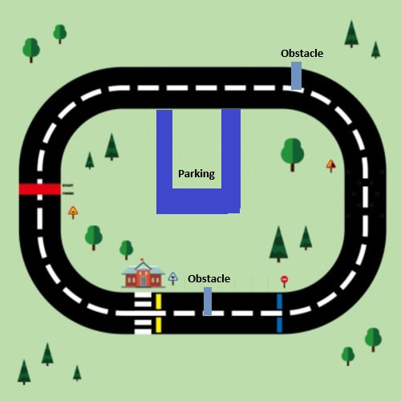
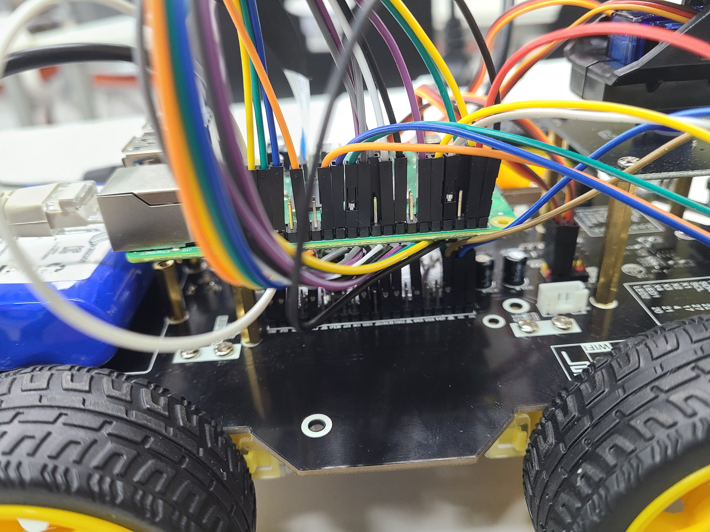
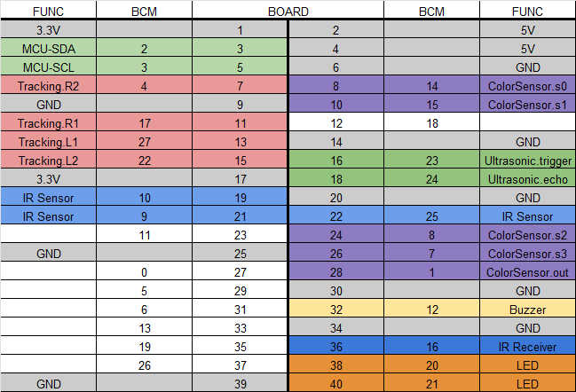
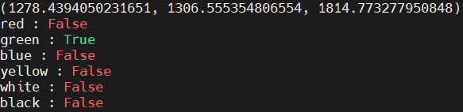

[](./README-en.md)
[](./README.md)

# Raspberrypi를 이용한 자율주행 차량

## 개요
Raspberrypi로 제어하는 자율주행 차량  
카메라를 이용하여 사물을 인식하는 것이 아닌 주어진 트랙과 조건내에서 자율주행하도록 하는 가벼운 프로젝트입니다.  

## 트랙
* 빨간선 - 빨간색을 처음 만났을 경우 차선 변경
* 파란선 - 일시정지
* 노란선 - 1/2 속도로 잠시 감속
* 장애물 - 장애물을 피한 뒤 다시 원래 차선으로 복귀
* 미끄러운 도로 표지판 - 1/2 속도로 감속하고 감속하고 있는 동안 1초간격으로 버저를 울린다
* 주차 표지판 - 2번째 바퀴에서 주차 표지판을 확인하면 주차장에 주차  


## 차량 구성
Yahboom사의 Raspbot을 이용 - [Raspbot](https://category.yahboom.net/products/raspbot)
* Motor
* Ultrasonic Sensor 
* Camera
* Color Sensor - [TCS3200 Color Sensor](https://wiki.dfrobot.com/TCS3200_Color_Sensor__SKU_SEN0101_) (Raspbot에서 제공하지 않음)




## PIN 구성   


## 구현
### python에서 RPI.GPIO 사용시 확인사항
GPIO.setmode()를 통해 GPIO 모드를 BCM과 BOARD중에서 선택할 수 있는데 main함수에서 사용하는 모든 파이썬 코드들은 같은 mode를 사용해야합니다. main.py에서 라이브러리로 사용하는 두코드에서 foo.py에서는 BCM모드로 사용하고 bar.py에서는 BOARD모드로 사용하면 에러가 발생합니다.  
BOARD모드는 raspberrypi의 핀번호, BCM모드는 위의 PIN사진을 참고하면 됩니다.  
GPIO.setwarnings(False)를 해놓으면 코드 실행시 warning문구가 뜨지 않습니다.

### car.py
차량의 모터, 카메라의 각도, 버저를 제어합니다.  
init의 addr은 raspberrypi와 i2c통신을 하기 위한 주소값으로 아래 코드를 통해 확인할 수 있습니다.
```ash
$ sudo apt-get install i2c-tools
$ sudo i2cdetect -y 1  
```
  
raspbot에서는 register는 모터는 0x01, 정지명령은 0x02, 카메라 각도 조절은 0x03이었습니다. 
smbus 라이브러리를 이용하여 i2c통신을 합니다. 값들을 디바이스에 addr, register, data를 보내 값을 쓰는 방식으로 모터를 제어합니다.

버저는 GPIO로 통신합니다. 버저는 GPIO.PWM으로 생성해놓습니다.  
생성한 버저는 start명령이 오면 세팅된 높이로 소리를 내고 stop명령을 주면 소리가 멈춥니다. 일정시간동안 소리가 나도록 하기 위해 start와 stop명령 사이에 time.sleep()명령을 추가하였습니다.  
메인 함수인 [tracer.py](tracer.py)에서는 소리가 나면서 움직여야 하기 떄문에 thread를 생성하여 버저를 동작하도록 하였습니다.

### colorsensor.py
컬러센서를 통해 차량 앞의 색상을 인식합니다.
컬러센서로 RGB값을 얻기위해 s2,s3를 설정한다음 out의 값을 확인합니다.  
* Red : s2-LOW, s3-LOW
* Green : S2-HIGH, s3-HIGH
* Blue : S2-LOW, S3-HIGH  

out값을 읽는 방법은 edge가 NUM_CYCLES만큼 발생하는데 걸리는 시간을 측정하여 NUM_CYCLES을 걸린시간으로 나누어 주파수를 구하여 사용합니다. 그렇기에 컬러센서의 정확도와 안정성을 올리고 싶다면 NUM_CYCLES 값을 올리고 속도가 더 중요하다면 NUM_CYCLES 값을 내리면 됩니다. 0~255값을 가지도록 정확하게 얻으려면 더 많은 데이터 처리가 필요할 것입니다.  
색상구별을 위해서 rgb값을 넣어 색상 비율을 통해 색상이 맞는지 아닌지를 판단하도록 하였습니다. 함수의 구체적인 값은 실제 환경에서 값을 테스트해 가면서 수정하였습니다.  
  
[tracer.py](tracer.py)의 실행부분의 주석 또는 color_test(color_sensor)함수를 이용하여 컬러센서 테스트가 가능합니다.  
  

### ultrasonic.py
차량의 전방에 장애물이 있는지 여부를 확인합니다.
trigger를 HIGH와 LOW로 두번발생하여 되돌아오는데 걸리는 시간을 측정합니다. 걸린 시간에 음속에 곱하여 장애물과의 거리를 파악합니다.

### tracer.py
main 실행코드 입니다.  

video() - 카메라 확인용 함수로 실행시 카메라와 지정한 범위의 색상만 보여주는 화면을 함께 보여줍니다. 
```python
ret, thresh1 = cv2.threshold(blur, 100, 255, cv2.THRESH_BINARY_INV)
```
해당 부분을 수정하면 됩니다.  
check_pos(camera) - 최초 코드 실행시 차량이 차선의 바깥쪽인지 안쪽인지 확인하는 작업을 카메라를 이용하여 수행합니다.  
sign_video() - 카메라를 통해 화면의 도형을 탐지하는 테스트용 함수입니다.  
sign_shape_detect(img) - 화면에 표지판이 있는지 확인하는 함수입니다. img는 카메라 화면입니다.  
run() - 실행코드입니다. ultrasonic, sign detect, color sensor를 확인하며 차량을 움직입니다.

## 연락처
thscksgur0903@gmail.com