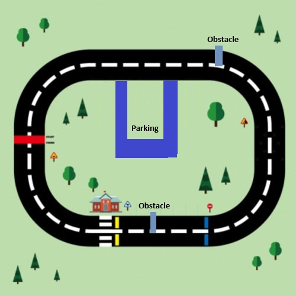
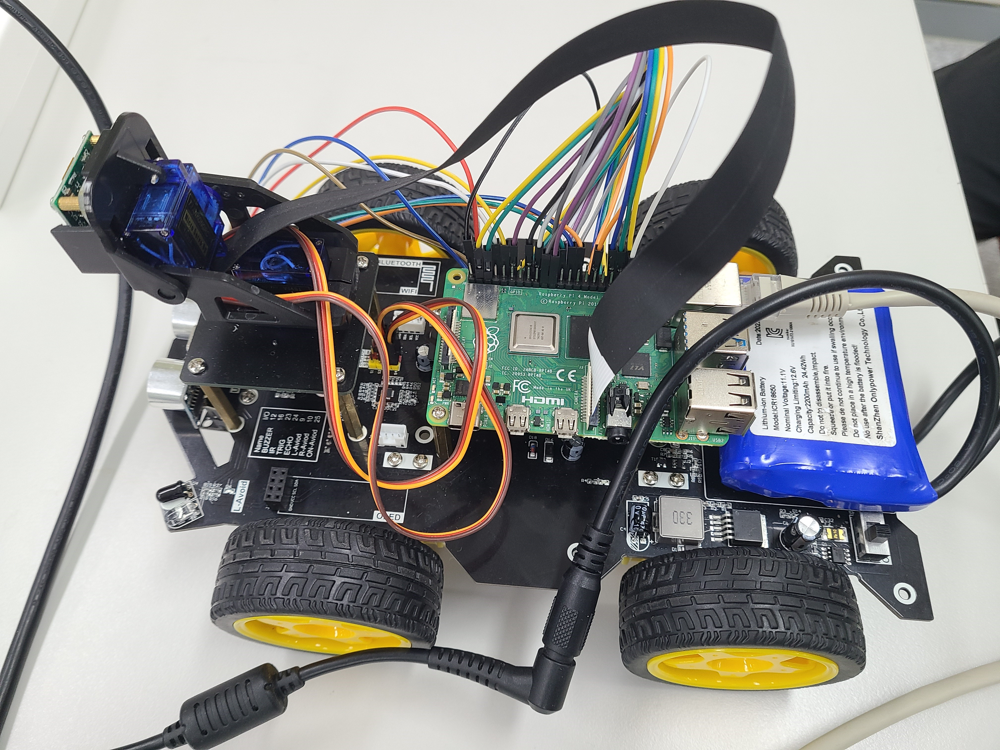
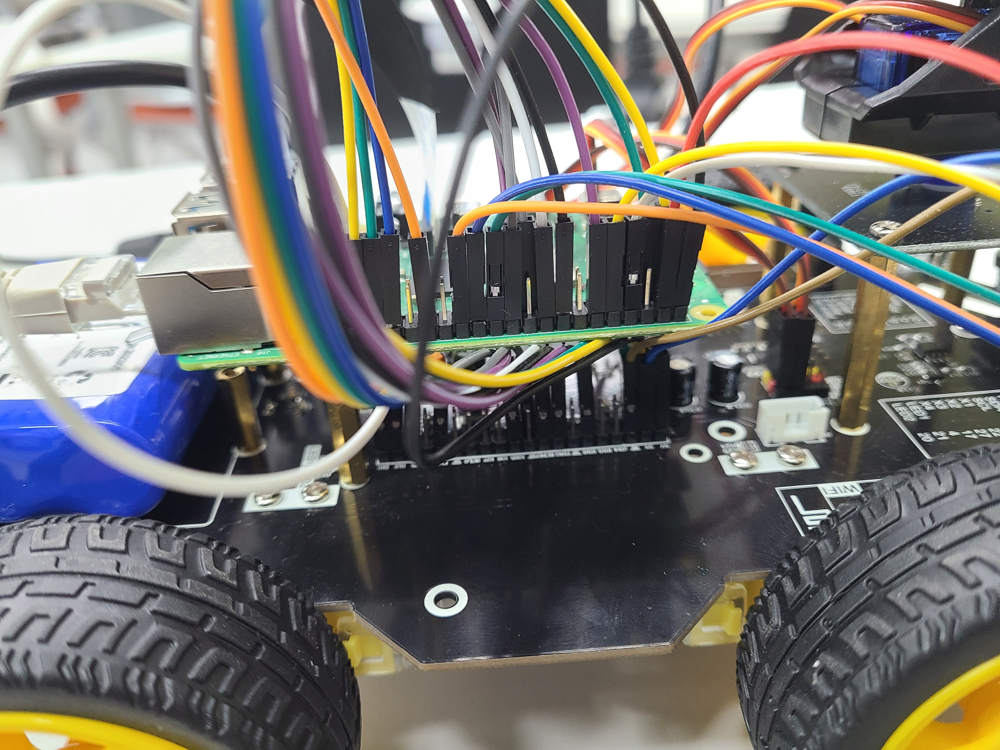
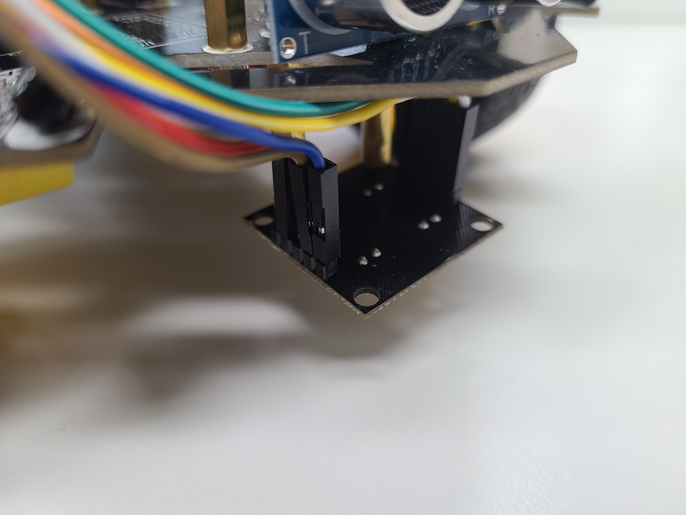
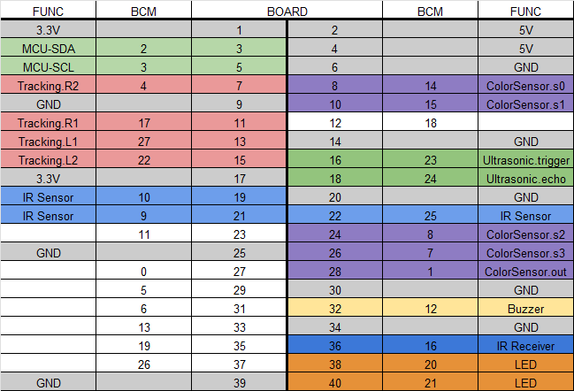
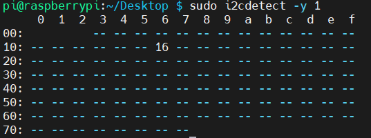
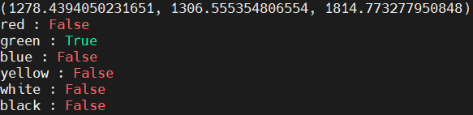

[](./README-en.md)
[](./README.md)

# Autonomous Driving Vehicle Using Raspberry Pi

## Overview
This is a lightweight project for autonomous driving within a given track and conditions, controlled by Raspberry Pi, not using object recognition through a camera.

## Track
* Red line - Change lanes upon first encountering the red color
* Blue line - Stop temporarily
* Yellow line - Decelerate to half speed for a moment
* Obstacles - Avoid obstacles and then return to the original lane
* Slippery road sign - Decelerate to half speed and ring the buzzer at one-second intervals while decelerating
* Parking sign - Park in the parking lot upon spotting the parking sign with the second wheel


## Vehicle Configuration
Using Yahboom's Raspbot - [Raspbot](https://category.yahboom.net/products/raspbot)
* Motor
* Ultrasonic Sensor
* Camera
* Color Sensor - [TCS3200 Color Sensor](https://wiki.dfrobot.com/TCS3200_Color_Sensor__SKU_SEN0101_) (not provided by Raspbot)




## PIN Configuration


## Implementation
### Notes when using RPI.GPIO in python
You can choose between BCM and BOARD mode through GPIO.setmode(), but all Python codes used in the main function must use the same mode. If foo.py uses BCM mode and bar.py uses BOARD mode, an error will occur.
BOARD mode refers to the pin number of Raspberry Pi, BCM mode can be referred to in the PIN picture above.
If you set GPIO.setwarnings(False), warning messages will not appear during code execution.

### car.py
Controls the vehicle's motor, the angle of the camera, and the buzzer.
The addr in init is the address value for communicating with Raspberry Pi via i2c, which can be checked with the code below.
```bash
$ sudo apt-get install i2c-tools
$ sudo i2cdetect -y 1  
```
addr  

In Raspbot, the register for the motor is 0x01, the stop command is 0x02, and camera angle adjustment is 0x03.
The smbus library is used for i2c communication. The motor is controlled by sending addr, register, and data values to the device.

The buzzer communicates via GPIO. The buzzer is created with GPIO.PWM.
The created buzzer will emit a sound at the set height when the start command is given and will stop when the stop command is given. To make the sound last for a certain period, a time.sleep() command is added between the start and stop commands.
In the main function [tracer.py](tracer.py), a thread is created to operate the buzzer while the vehicle is moving.

### colorsensor.py
The color sensor recognizes the color in front of the vehicle.
To obtain RGB values from the color sensor, set s2 and s3, then check the value of out.

* Red: s2-LOW, s3-LOW
* Green: S2-HIGH, s3-HIGH
* Blue: S2-LOW, S3-HIGH   

The method of reading the out value is to measure the time it takes for NUM_CYCLES edges to occur and use the frequency obtained by dividing NUM_CYCLES by the elapsed time. Therefore, if you want to increase the accuracy and stability of the color sensor, increase the NUM_CYCLES value. If speed is more important, decrease the NUM_CYCLES value. More data processing will be required to accurately obtain values from 0 to 255.
To differentiate colors, the rgb values are entered and the color is determined through the color ratio. The specific values of the function were modified while testing in the actual environment.

You can test the color sensor with the comment section of the [tracer.py](tracer.py) execution part or the color_test(color_sensor) function.
  

### ultrasonic.py
Checks for obstacles in front of the vehicle.
The trigger occurs twice as HIGH and LOW, and the time it takes for it to return is measured. The distance to the obstacle is determined by multiplying the elapsed time by the speed of sound.

### tracer.py
Main execution code.

video() - A function for checking the camera, which shows the camera and a screen that only displays the specified color range when executed.

```python
ret, thresh1 = cv2.threshold(blur, 100, 255, cv2.THRESH_BINARY_INV)
```
Modify the above part as needed.  
check_pos(camera) - Uses the camera to check if the vehicle is outside or inside the lane when the code is first executed.
sign_video() - A test function that detects shapes on the screen through the camera.  
sign_shape_detect(img) - A function that checks for signs on the screen. img is the camera screen.  
run() - The execution code. Moves the vehicle while checking the ultrasonic, sign detect, and color sensor.